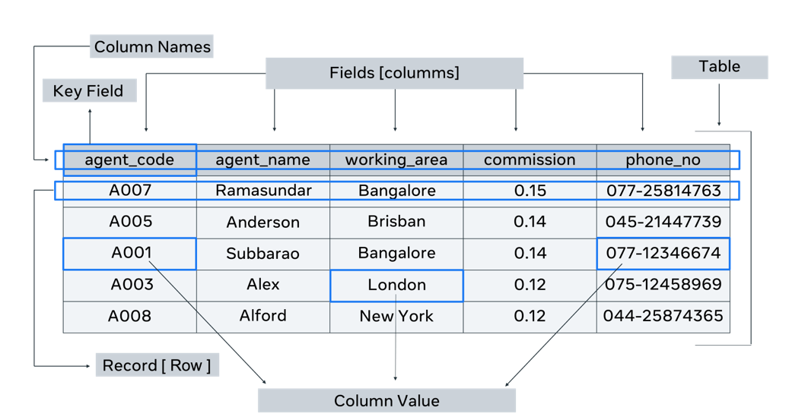
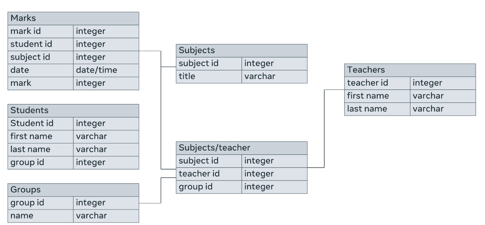
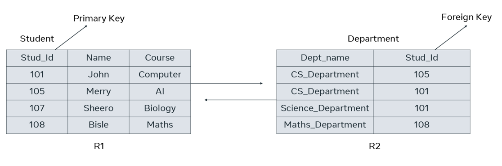

# Understanding Database Structure

## Introduction

In the realm of databases, understanding the fundamental structure is crucial for effective data management. This overview delves into the core components that constitute a database's structure. You'll gain insights into tables, fields (attributes), records, keys, and the importance of these elements in database design.

## Database Structure Essentials

### 1. Tables (Entities)

- **Definition**: Tables, often referred to as entities, are the primary storage containers for data in a database.
- **Role**: They group related data together, making it organized and accessible.
- **Example**: In a database for a library system, you might have tables for "Books," "Authors," and "Customers."

### 2. Attributes

- **Definition**: Attributes provide detailed information about a table or entity.
- **Role**: They describe the characteristics or properties of a table, adding context to the data.
- **Example**: In the "Books" table, attributes could include "Title," "Publication Year," and "Genre."

### 3. Fields (Columns)

- **Definition**: Fields, or columns, are the containers within a table used to capture attributes.
- **Role**: Each field corresponds to an attribute and stores the actual data.
- **Example**: Within the "Books" table, you'd have fields like "Title," "Author," and "ISBN."

### 4. Records (Rows)

- **Definition**: Records, also known as rows, represent individual entries or instances within a table.
- **Role**: Each row contains a set of values, one for each field, providing specific details about an entity.
- **Example**: A record in the "Books" table could represent a specific book with values for each attribute.

### 5. Primary Key

- **Definition**: The primary key is a unique identifier for each entity or record within a table.
- **Role**: It ensures data integrity and enables efficient data retrieval.
- **Example**: In a "Customers" table, each customer could be uniquely identified by a customer ID, serving as the primary key.

## Visual Representation

This image provides a visual representation of these structural elements within a database table:

## Table

- A **table** contains all the fields, attributes, and records for a type of entity.
- A database typically contains multiple tables.

## Fields

- **Fields** are column headings in a table.
- Each field represents a different attribute.
- Each field stores a unit of data, also known as a column value.
- Each column has a specific data type.
- Example: The "agent_name" column has a data type of text, while the "commission" column has a numeric data type.

## Column Value or Unit of Data

- A **column value** or **unit of data** is each individual piece of data entered into a column.
- These units are also referred to as data elements or column values.

## Records

- A **record** consists of a collection of data for each entity.
- It's also known as a row in the table.

## Data Types

- Data types are assigned to columns to maintain data consistency.
- A column's data type determines the type of data that can be stored in it.
- Different data types require varying amounts of memory and support different operations.
- Common data types include numeric types (e.g., INT, FLOAT), date and time types (e.g., DATE, DATETIME), and character and string types (e.g., CHAR, VARCHAR).

## Logical Database Structure

- The **logical structure** of a database is represented using an Entity Relationship Diagram (ERD).
- An ERD visually outlines how the database will be implemented into tables during physical database design using a Database Management System (DBMS) like MySQL or Oracle.
- Relationships between entities are a crucial part of the logical database structure.
  
## Cardinality of Relationships

- Relationships between entity instances can be categorized into:
  - **One-to-One Relationships**
  - **One-to-Many Relationships**
  - **Many-to-Many Relationships**
- This categorization is known as the cardinality of relationships.
- The ERD represents these relationships.
  
## Example ERD

In summary, a database's structure involves tables, fields, records, data types, and logical representation through an ERD. Understanding these elements is essential for effective database design and management.

## Physical Database Structure

- In the **physical database structure**, entities are implemented as tables.
- Relationships between tables are established using a field known as a **foreign key**.
- A foreign key is a field in one table that refers to a common field in another table, typically the primary key of that table.

## Foreign Keys in Relationships

- Foreign keys play a crucial role in connecting tables within a database.
- They establish relationships between tables by linking them through shared fields.
- Typically, a foreign key in one table references the primary key of another table.

## Example: Student and Department Tables

- Consider a database with two tables: **student** and **department**.
- The **student** table has a primary key called "Stud_id."
- This "Stud_id" is also present in the **Department** table as a foreign key.
- Consequently, the two tables are related to each other through the "Stud_id" field.

In summary, the physical database structure utilizes foreign keys to create relationships between tables. These keys enable efficient data retrieval and maintain data integrity.
