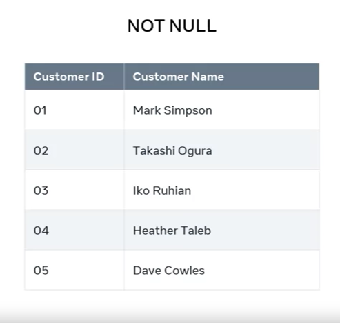
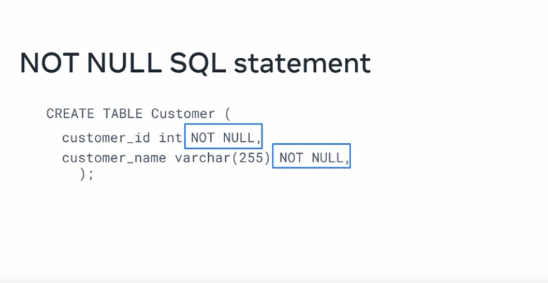
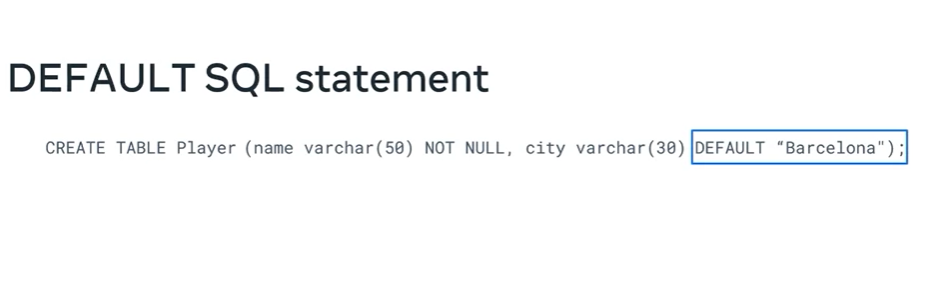

# Understanding Database Constraints and Default Values

## Introduction
- This tutorial explores the significance of database constraints and how they help ensure data accuracy and reliability.
- It also covers the use of default constraints to set default values in database tables.

## Database Constraints
- Database constraints are rules that limit the type of data that can be stored in a table.
- They ensure that all data inserted into the table is accurate and reliable.
- Violating these constraints aborts data operations, preventing the insertion of invalid data.

## Types of Database Constraints
- Constraints can be column-level (apply to specific columns) or table-level.
- Commonly used constraints include:
  1. NOT NULL: Ensures that a data field is always completed and never left blank.
  2. DEFAULT: Sets default values for columns when no specific value is provided.

## NOT NULL Constraint

- The NOT NULL constraint ensures that specified columns cannot contain empty or null values.
- Example: In a customer table, both customer ID and customer name columns must always contain data.
- Implemented using SQL statements when creating a table.

## DEFAULT Constraint

- The DEFAULT constraint assigns default values to columns when no value is specified.
- Example: In a player table for a football club's database, the default city for most players is set to "Barcelona."
- If no city value is provided when adding a new player, "Barcelona" is automatically inserted.
- Implemented in SQL statements by specifying the default value for a column.

## SQL Statements for Constraints
- To implement constraints in SQL statements:
  - Use the CREATE TABLE command to define the table structure.
  - Specify column names, data types, and constraints within parentheses.
  - Use the NOT NULL constraint to ensure data integrity.
  
  - Use the DEFAULT constraint to set default values for columns.
  

## Conclusion
- Database constraints, such as NOT NULL and DEFAULT, are crucial for maintaining data accuracy and reliability.
- They enforce rules at the column or table level, preventing the insertion of invalid data.
- Properly implementing constraints ensures data consistency in your database.
