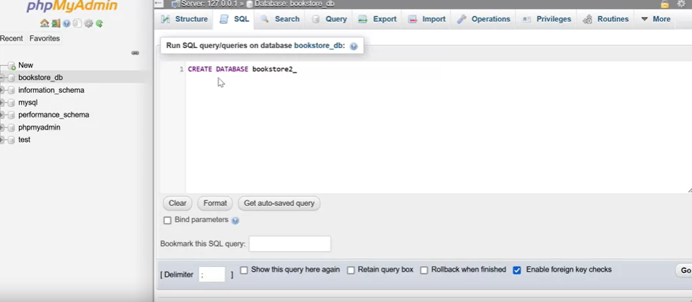

# Creating and Deleting Databases with SQL

## Introduction
- In this tutorial, we'll explore the process of creating and deleting databases using SQL (Structured Query Language).
- Databases play a crucial role in storing and managing vast amounts of information, and understanding how to create and maintain them is essential for various applications.

## Creating a Database

- Before creating a database, you need a clear understanding of its purpose and what data it will store.
- SQL provides a straightforward way to create databases using the `CREATE DATABASE` statement.
- Syntax:
  ```sql
  CREATE DATABASE database_name;
  ```
- Example:
  ```sql
  CREATE DATABASE bookstore2_db;
  ```
- Database names should be meaningful, unique, and adhere to character limits (typically 63 characters).

## Deleting a Database
- To delete a database, you can use the `DROP DATABASE` statement.
- Syntax:
  ```sql
  DROP DATABASE database_name;
  ```
- Example:
  ```sql
  DROP DATABASE bookstore_db;
  ```
- Make sure to exercise caution when deleting databases, as this action permanently removes all data within the database.
- Database deletion is often used for cleanup or when a database is no longer needed.

## Conclusion
- In this tutorial, you've learned how to create and delete databases using SQL.
- Creating a database involves defining its purpose and using the `CREATE DATABASE` statement.
- Deleting a database is done with the `DROP DATABASE` statement, but be cautious when using it as data loss is irreversible.
- Properly managing databases is crucial for various applications, including online bookstores.
