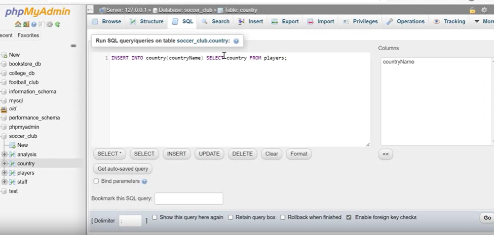

# SQL INSERT INTO SELECT Statement

When working with tables, you may need to retrieve data from one table and insert it into another. The SQL `INSERT INTO SELECT` statement allows you to perform these actions efficiently. In this guide, we'll explore the syntax and usage of the `INSERT INTO SELECT` statement.

## Syntax

The `INSERT INTO SELECT` statement has the following syntax:

```sql
INSERT INTO target_table (target_column)
SELECT source_column
FROM source_table;
```

- `INSERT INTO`: Keyword to initiate the insertion.
- `target_table`: Name of the table where you want to insert data.
- `(target_column)`: Name of the column in the target table where data will be inserted.
- `SELECT`: Keyword to specify the data to be retrieved.
- `source_column`: Name of the column in the source table containing the data you want to insert.
- `FROM`: Keyword to specify the source table from which data will be retrieved.

## Example

Let's illustrate the `INSERT INTO SELECT` statement with an example using tables from a soccer club database. In this database:

- `players` table contains player records.
- `country` table holds information about players' countries but lacks country names.

### Task

We want to populate the `country` table with country names from the `players` table.

### SQL Query

Here's the SQL query to accomplish this:

```sql
INSERT INTO country (countryName)
SELECT country
FROM players;
```


- `INSERT INTO country`: We specify the `country` table as the target.
- `(countryName)`: Data from the `country` column in the `players` table will be inserted into the `countryName` column in the `country` table.
- `SELECT country`: We retrieve the `country` data from the `players` table.
- `FROM players`: We specify the source table, which is `players`.

After running this query, the `country` table will be populated with country names.

## Conclusion

The `INSERT INTO SELECT` statement is a powerful tool for transferring data between tables in SQL. It allows you to query data from a source table and insert it into a target table, making it a valuable operation in database management.