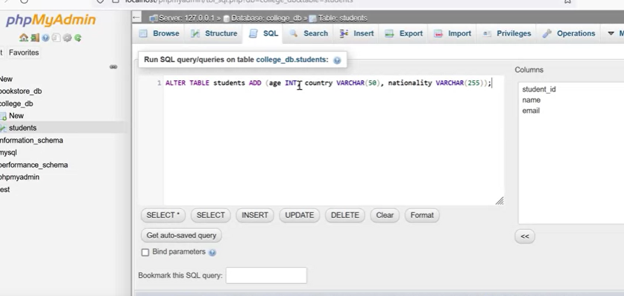
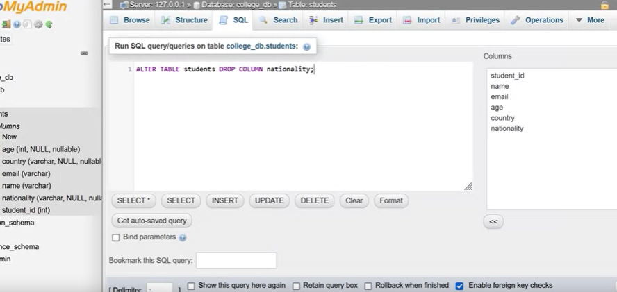
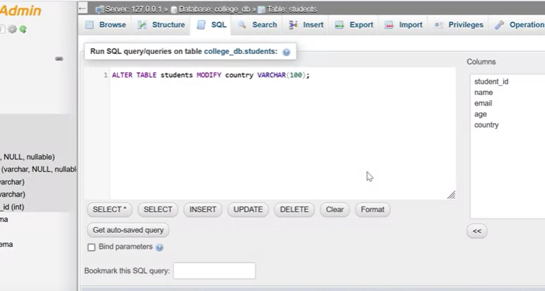

# Altering and Modifying Database Tables with SQL

## Introduction
- In database management, tables often need to be modified to accommodate changing requirements.
- SQL provides the ability to alter and modify database tables, allowing developers to add or remove columns and adjust column attributes.

## SQL `ALTER TABLE` Statement Syntax
- To alter a table, SQL uses the `ALTER TABLE` statement, which can be used to add, remove, or modify columns.
- The basic syntax for adding a column is as follows:
  ```sql
  ALTER TABLE table_name
  ADD column_name datatype;
  ```

## Adding Columns
- To add a new column to an existing table, use the `ALTER TABLE` statement with the `ADD` keyword.
- Specify the table name and then declare the new column's name and data type within parentheses.


## Removing Columns
- To remove an existing column from a table, use the `ALTER TABLE` statement with the `DROP COLUMN` keyword.
- Specify the table name and the name of the column to be removed.

## Modifying Column Attributes
- You can also modify the attributes of an existing column, such as changing its data type or size.
- Use the `ALTER TABLE` statement with the `MODIFY` keyword, followed by the column name and the new data type or size.

## Example: Altering a "Students" Table
- Suppose you have a "Students" table in the "College" database.
- You can add new columns "age," "nationality," and "country" using the `ALTER TABLE` statement.
- To remove the "nationality" column, use the `DROP COLUMN` keyword.
- To modify the "country" column's character limit to 100, use the `MODIFY` keyword.

```sql
-- Adding columns
ALTER TABLE Students
ADD age INT,
ADD nationality VARCHAR(255),
ADD country VARCHAR(100);

-- Removing the "nationality" column
ALTER TABLE Students
DROP COLUMN nationality;

-- Modifying the "country" column
ALTER TABLE Students
MODIFY country VARCHAR(100);
```

## Conclusion
- SQL's `ALTER TABLE` statement is a powerful tool for modifying database tables.
- Developers can easily adapt their database structures by adding, removing, or modifying columns.
- A good understanding of these SQL commands is essential for effective database management.
