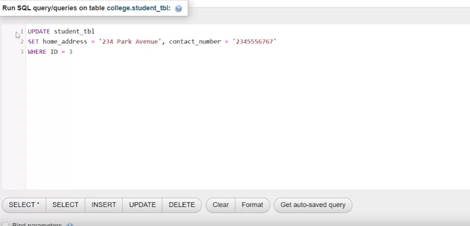
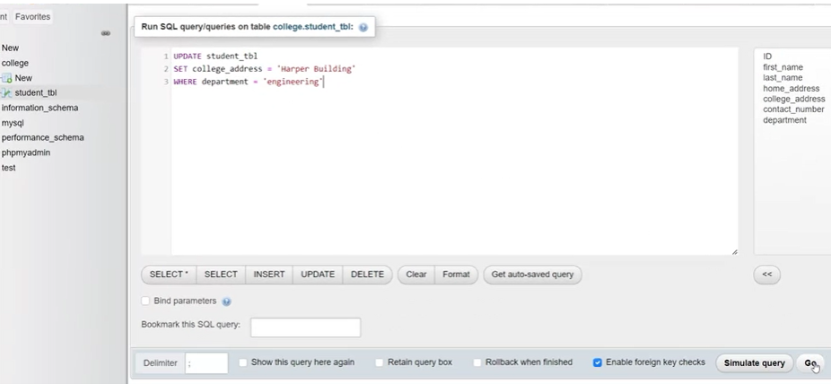
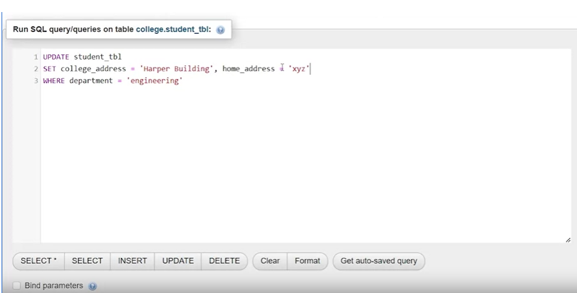

# Updating Data in a SQL Table

In this guide, we'll explore how to update data in a SQL table using the `UPDATE` statement. We'll cover both single-record updates and multiple-record updates.

## Single-Record Update

### Target Table: `student_table`

- Columns: ID, first name, last name, home address, college address, contact number, department.

To update a single student's home address and contact number (student with ID 3):

```sql
UPDATE student_table
SET home_address = 'New Home Address', contact_number = 'New Contact Number'
WHERE ID = 3;
```


- Use `UPDATE` followed by the table name (`student_table`).
- Employ the `SET` clause to specify the columns to be updated (`home_address` and `contact_number`) along with their new values.
- Use the `WHERE` clause to identify the specific record to update (in this case, where ID equals 3).

Upon executing this query, a confirmation message is received, and the updated values are displayed in the table for student ID 3.

## Multiple-Record Update

Suppose the college's engineering department changes its address for all engineering students:

```sql
UPDATE student_table
SET college_address = 'Harper Building'
WHERE department = 'Engineering';
```


- Use `UPDATE` followed by the table name (`student_table`).
- Employ the `SET` clause to update the `college_address` column to 'Harper Building'.
- Use the `WHERE` clause to specify that this update applies to all students with 'Engineering' in the `department` column.

Running this query updates the `college_address` for all engineering students.

### Updating Multiple Columns

You can also update multiple columns in one statement:

```sql
UPDATE student_table
SET home_address = 'New Home Address', contact_number = 'New Contact Number'
WHERE ID = 3;
```


- Extend the `SET` clause with comma-separated column-value pairs.
- Update both the `home_address` and `contact_number` columns for the student with ID 3.

This allows you to update multiple columns in multiple records using a single `UPDATE` statement.

In summary, the `UPDATE` statement in SQL is a powerful tool for modifying data within a table. It can be used for single-record updates, as well as updates across multiple records and columns, providing flexibility in managing your database.