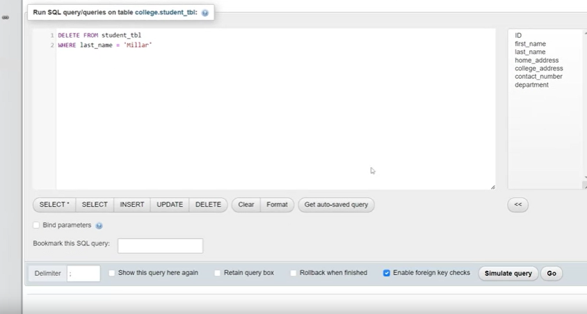
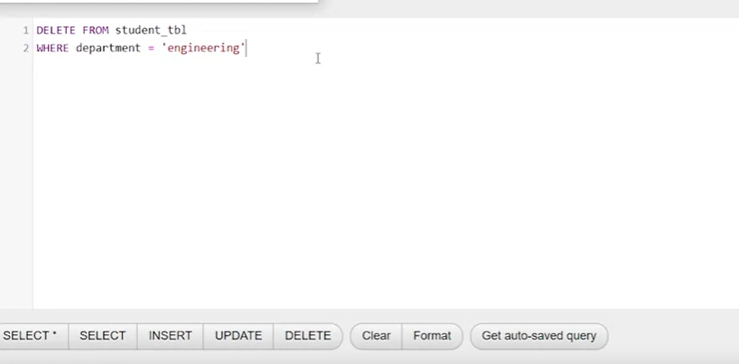
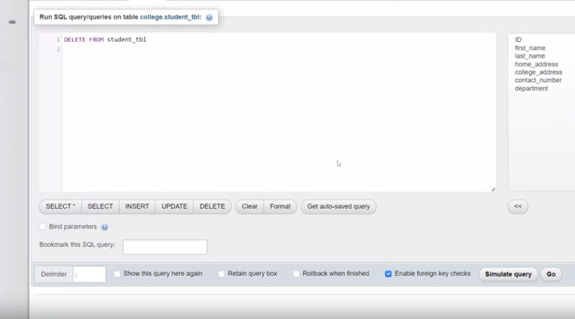

# Deleting Records from a Database Table

## Deleting a Single Record

- To delete a single record from a table in a database:
  - Use SQL in phpMyAdmin.
  - Target the "student" table.
  - Use a delete statement with a where clause.
  - Specify the condition to identify the data to delete, e.g., last name equals "Miller."
  - Execute the statement by clicking the "go" button.

```sql
-- SQL Code to delete a single record with the last name "Miller"
DELETE FROM student_table
WHERE last_name = 'Miller';
```


- Confirmation message: Record "Miller" is deleted.
- Verify by checking the "student" table in the left panel.

## Deleting Multiple Records

- Deleting records for multiple students in the "engineering" department:
  - Similar beginning with delete and from keywords for the "student" table.
  - Use a where clause to specify the condition, e.g., department equals "engineering."
  - Be cautious to avoid deleting all records in the table.

```sql
-- SQL Code to delete records for engineering students
DELETE FROM student_table
WHERE department = 'engineering';
```


- Confirmation: Records for engineering students are deleted.
- Verify by checking the "student" table.

## Deleting All Records

- To delete all records from a table:
  - Use SQL syntax: "delete from student_table."
  - Remove the where clause.

```sql
-- SQL Code to delete all records from the student table
DELETE FROM student_table;
```


- Execute by clicking "go."
- Confirmation: All records are deleted.
- Verify by checking the "student" table, which should now be empty.