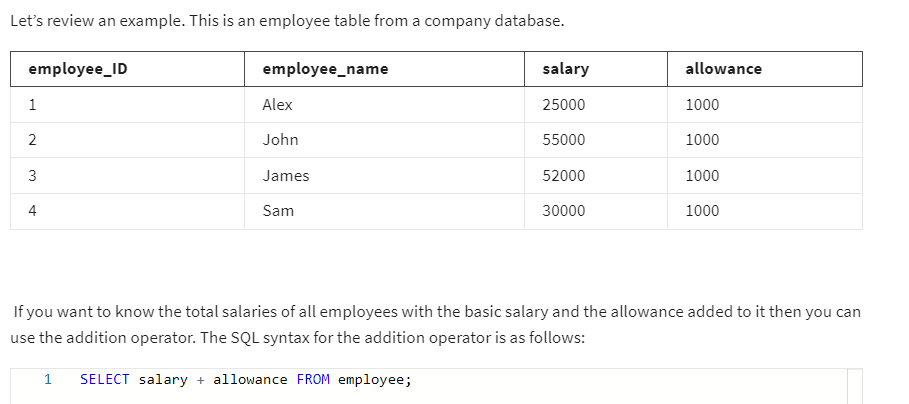
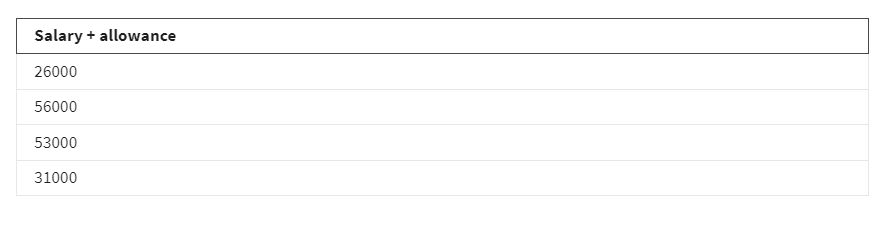
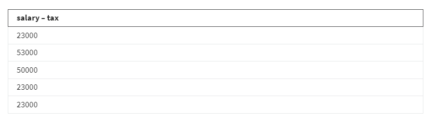
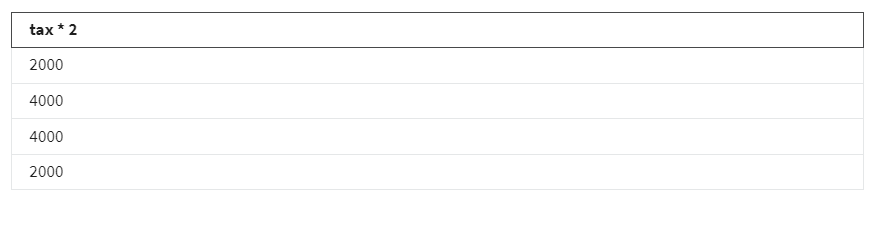
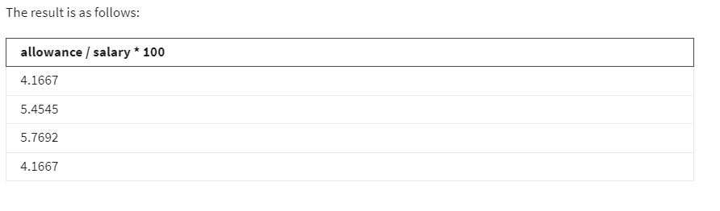
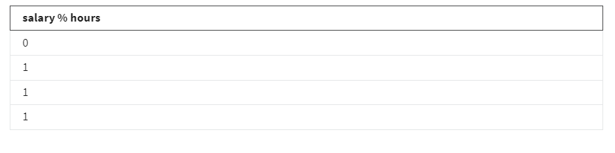
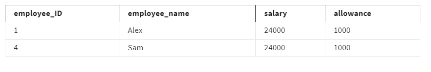
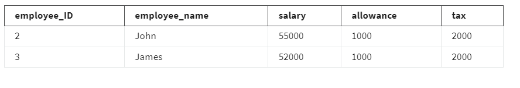
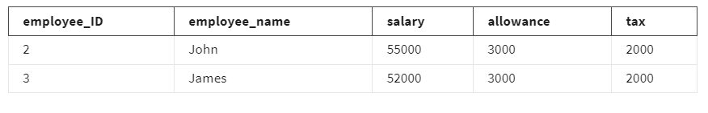
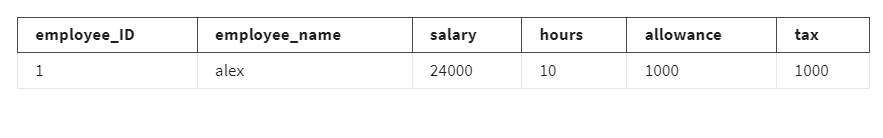

# SQL Arithmetic Operator Examples

## Introduction

- This reading explores SQL arithmetic operators, which are used for performing mathematical operations in SQL.
- It covers basic operations like addition, subtraction, multiplication, division, and modulus.
- The examples provided illustrate how these operators can be applied in SQL queries.

## Arithmetic Operators in SQL

- Arithmetic operators are valuable for performing mathematical operations on data retrieved from database tables using SQL SELECT queries.
- They are specifically used with numerical data stored in database tables.
- These operators can be applied both in the SELECT clause and the WHERE clause of SQL SELECT statements.

## Available Arithmetic Operators

- The primary arithmetic operators in SQL are:
  - **Addition (+)**
  - **Subtraction (-)**
  - **Multiplication (*)**
  - **Division (/)**
  - **Modulus (%)**

## Using the Addition Operator

- The addition operator (`+`) performs mathematical addition on numerical data within columns of a table.
- Example: Calculating the total salary of employees with salary and allowance.
  - SQL Syntax:
    ```sql
    SELECT salary + allowance FROM employee;
    ```
    
    

## Using the Subtraction Operator

- The subtraction operator (`-`) performs mathematical subtraction on numerical data within columns.
- Example: Finding salaries after tax deductions.
  - SQL Syntax:
    ```sql
    SELECT salary - tax FROM employee;
    ```
    

## Using the Multiplication Operator

- The multiplication operator (`*`) performs mathematical multiplication on numerical data within columns.
- Example: Doubling the tax amounts for employees.
  - SQL Syntax:
    ```sql
    SELECT tax * 2 FROM employee;
    ```
    
## Using the Division Operator

- The division operator (`/`) divides numerical values of one column by those of another.
- Example: Calculating allowance percentage for employees.
  - SQL Syntax:
    ```sql
    SELECT allowance / salary * 100 FROM employee;
    ```
    
## Using the Modulus Operator

- The modulus operator (`%`) finds the remainder when one column's values are divided by another's.
- Example: Checking if the number of hours worked by employees is even.
  - SQL Syntax:
    ```sql
    SELECT hours % 2 FROM employee;
    ```
    
## Using Arithmetic Operators in the WHERE Clause

- Arithmetic operators can also be used in the WHERE clause to filter results.
- Example: Finding employees with a total salary of 25000.
  - SQL Syntax:
    ```sql
    SELECT * FROM employee WHERE salary + allowance = 25000;
    ```
    
- Example: Finding employees who must pay a tax of 2000 after doubling their current tax.
  - SQL Syntax:
    ```sql
    SELECT * FROM employee WHERE tax * 2 = 4000;
    ```
    
- Example: Identifying employees with an allowance of at least 5% of their salary.
  - SQL Syntax:
    ```sql
    SELECT * FROM employee WHERE allowance / salary * 100 >= 5;
    ```
    
- Example: Finding employees who worked an even number of hours.
  - SQL Syntax:
    ```sql
    SELECT * FROM employee WHERE hours % 2 = 0;
    ```
    
## Conclusion

- This reading delves into the usage of arithmetic operators in SQL, demonstrating various operations and their practical applications in SQL queries.
- By understanding these operators, you can perform complex calculations and data manipulations efficiently using SQL.

**End of Notes**

