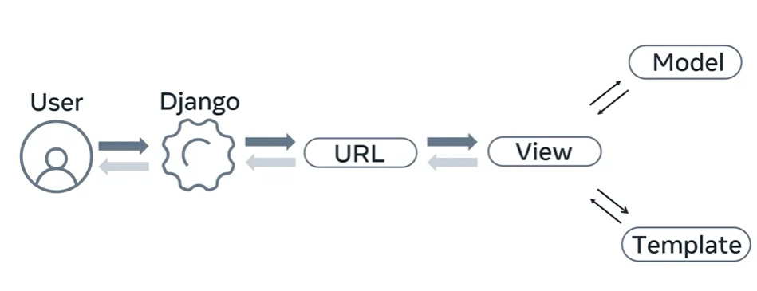
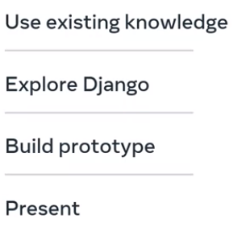
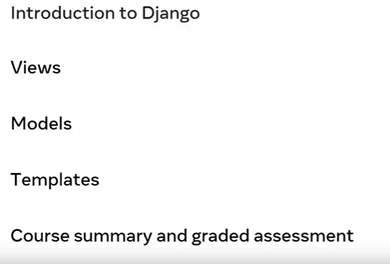
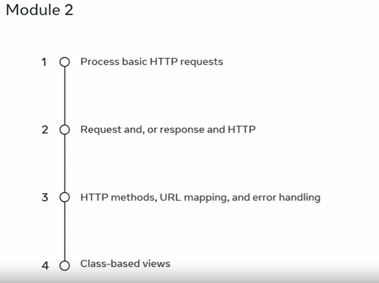
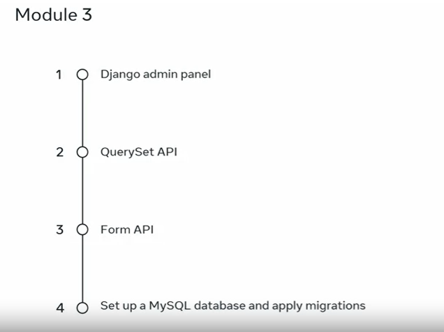
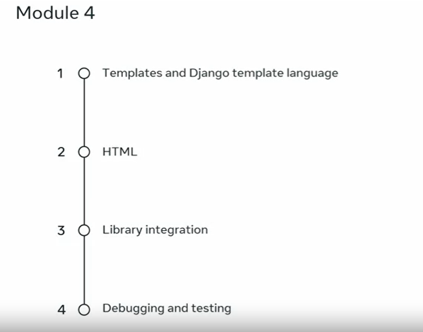
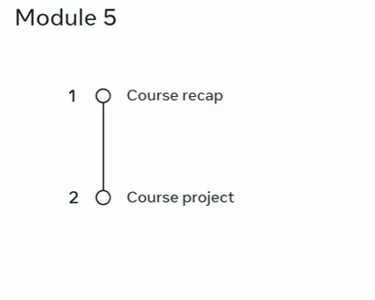

# Django Framework Course Overview

## Introduction

- This course focuses on the Django framework, which is used to build large-scale backend web applications.
- It combines your existing knowledge of databases, Python, HTML, and CSS to create dynamic web applications using Django.
- You'll embark on a learning journey to become a proficient Django developer.

## What is Django?

- Django is an open-source web framework written in Python.
- It is a popular choice for building backend web applications.
- To work with Django effectively, you'll need a strong foundation in databases, Python, HTML, and CSS.

## Course Structure

- This course is divided into five modules, each covering essential aspects of Django development.
- You'll be introduced to Django, explore views, models, templates, and finally, work on a graded assessment.

## Module 1: Introduction to Django

- Learn about web frameworks and how Django is used for web development.
- Understand the components of Django projects and apps.
- Explore command-line tools (django-admin and manage.py) for project and app creation.
- Dive into the Model-View-Template (MVT) pattern and code reusability.

## Module 2: Exploring Views

- Understand the concept of views in Django and how they handle HTTP requests.
- Learn about request and response objects for common operations.
- Differentiate parameters and associate them with HTTP methods (GET, PUT, POST, DELETE).
- Explore URL patterns and error handling in views.
- Discover class-based views and their reuse across projects.

## Module 3: Working with Models

- Explore Django admin panel for user and group permissions.
- Use the QuerySet API to interact with the database.
- Create forms and bind data to objects using the form API.
- Set up a MySQL database and apply migrations for data management.

## Module 4: Mastering Templates

- Learn to create templates and use the template language for markup.
- Utilize templating to generate HTML.
- Integrate third-party libraries into your Django app.
- Explore debugging and testing in Django.

## Module 5: Course Project

- Recap the key elements of the course.
- Apply your knowledge by creating a data-driven web application for Little Lemon Restaurant.

## Course Delivery

- The course consists of instructional videos that guide you through the learning process.
- You can watch, pause, rewind, and re-watch videos until you grasp the concepts.
- Consolidate your knowledge through course readings and exercises.
- Self-check your progress with knowledge quizzes.
- Engage with classmates through course discussion prompts to share knowledge and discuss challenges.

## Success Tips

- Commit to a regular and disciplined approach to learning.
- Create a study schedule with dedicated dates and times for the course.
- Remember that this online, self-paced course requires dedication and commitment.
- It's part of a program of courses that can lead to a career in backend development.

