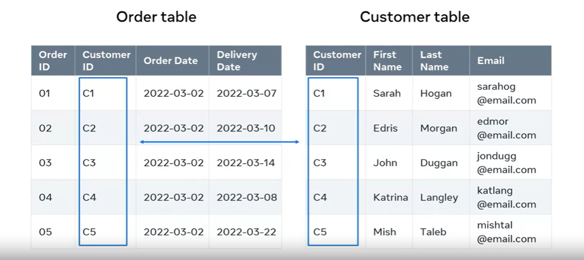

# Course Notes: Understanding Data Relationships in Databases

## Introduction

- Managing a database for a large online store.
- The importance of establishing relationships between data.
- Objectives: Explain data relationships in a database and identify instances of related data.

## Why Data in a Database Should Be Related

- Data in a database should not exist in isolation.
- Data relationships are crucial for processing data into meaningful information.

## Establishing Data Relationships

- Example scenario: An online store's database.
- Two key tables: Customer table and Order table.
- Relating customer data to order data using a unique identifier.
- Customer table structure: Fields (Customer ID, FirstName, LastName, Email).
- Records in the customer table represent instances of customers.
- Each customer instance must be uniquely identifiable.
- Primary Key Field: Contains unique values (e.g., Customer ID).
- Purpose of primary key: Ensure uniqueness and identify customers.
- Order table structure: Fields (Order ID, Customer ID).
- The customer ID field in the order table connects to the customer table.
- Foreign Key Field: Connects to the primary key field in another table.
- Establishing the relationship between customer and order data.

## Conclusion

- Understanding the importance of data relationships in databases.
- Recognizing primary key and foreign key fields.
- Identifying related data instances.
- Prepared to manage and work with related data in databases.
