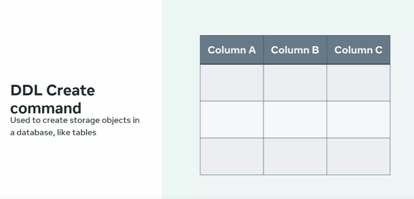
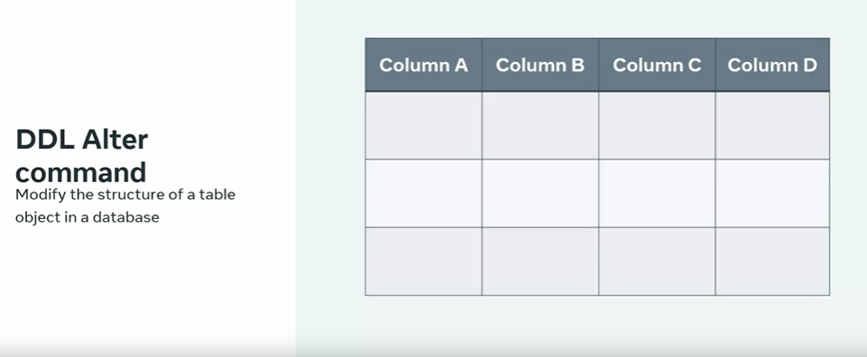
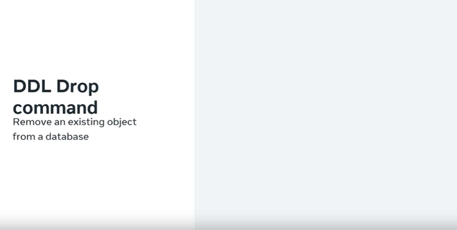
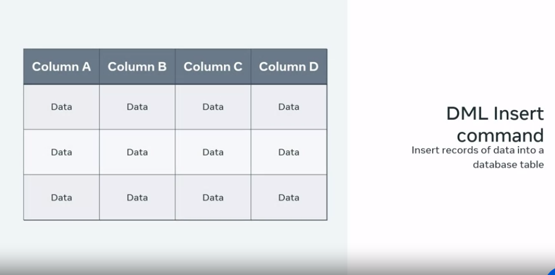
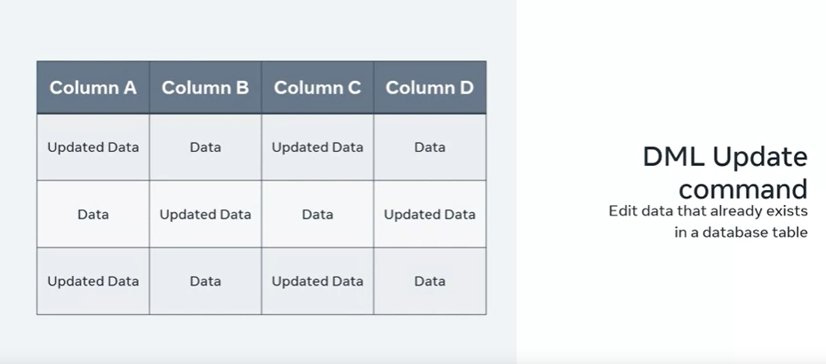
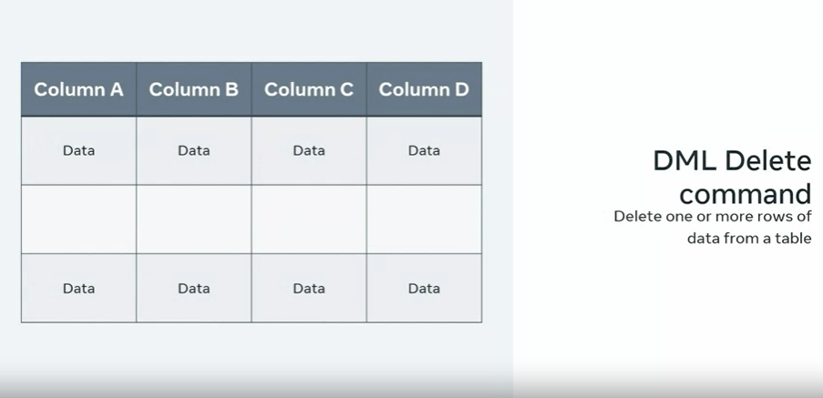
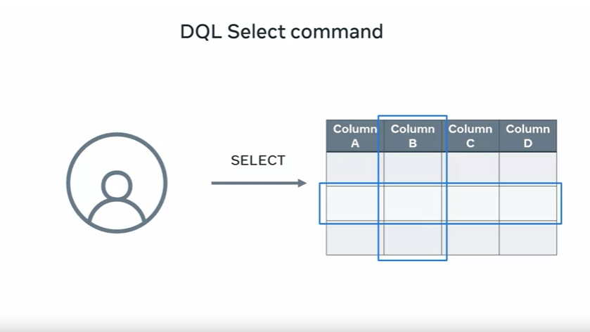
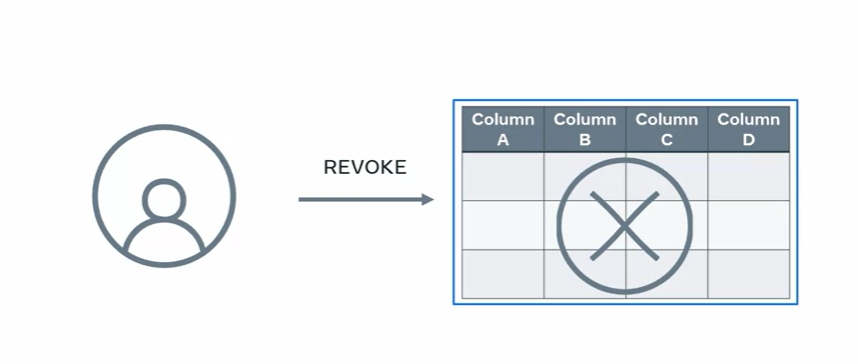

# Understanding SQL Operations and Sublanguages

Imagine you're tasked with creating a database for a college, managing various aspects of the institution. This involves creating tables, inserting data, and updating information as needed. Thankfully, SQL and CRUD operations make this all possible. In the next few minutes, you'll learn to explain the tasks SQL syntax accomplishes when constructing a database, along with an understanding of SQL subsets and sublanguages.

## CRUD Operations in SQL

- **CRUD Definition**: CRUD stands for Create, Read, Update, and Delete, representing the most common tasks when working with databases.
- **CRUD in Action**: These operations involve creating and adding data, reading data, updating existing data, and deleting data. SQL is fundamental for performing these tasks.

## SQL Sublanguages

Depending on its purpose, SQL can be divided into various sublanguages, each serving distinct roles:

1. **DDL (Data Definition Language)**: DDL helps define data within your database.
   - **Create**: This command creates the database and related objects like tables where data will be stored.
   
   - **Alter**: You can modify the structure of database objects, such as adding new columns to a table.
   
   - **Drop**: Use this command to remove objects like tables from the database.
   

2. **DML (Data Manipulation Language)**: DML commands manipulate data in the database.
   - **Insert**: To add data to a table, use this command, specifying fields and values to be inserted.
   
   - **Update**: To edit already-inserted data in a table, deploy the update command.
   
   - **Delete**: You can specify data for removal using the delete command.
   

3. **DQL (Data Query Language)**: DQL retrieves data from the database.
   - **Select**: Retrieve data from one or multiple tables, specifying desired data fields and filter criteria.
   

4. **DCL (Data Control Language)**: DCL is employed to control database access.
   - **Control Access**: Grant and revoke commands manage access privileges to the database, controlling user access.

These sublanguages and commands make SQL the interface between databases and users, allowing for efficient data management.

By understanding these SQL operations and sublanguages, you're equipped to interact with databases effectively. Great job!
