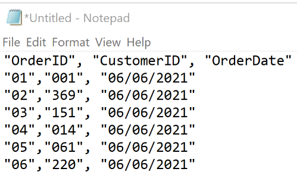
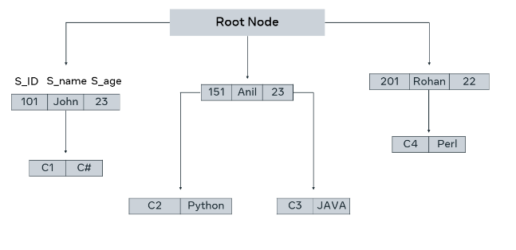
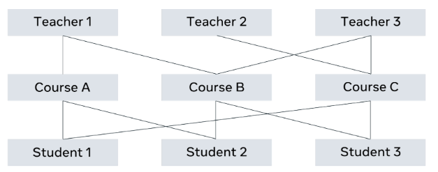
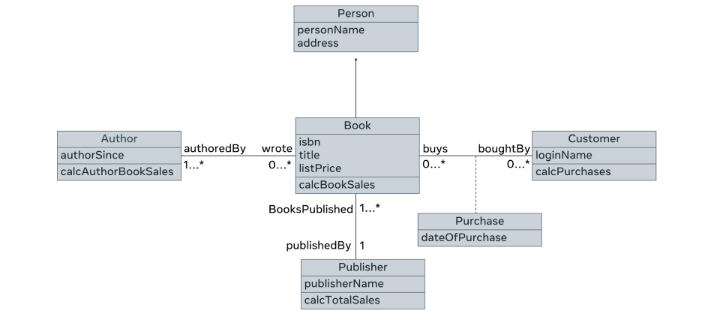

# Evolution of Database Technology

## Introduction
- Recap: Understanding databases, data relationships, and types of databases.
- Explore the history and evolution of database technology.

## Historical Development
- **1960s**: Computerization of databases begins.
- **1970s-1990s**: Types of Databases
  - *Flat Files*: Single-file storage, often text-based.
  
  - *Hierarchical*: One-to-many relationships, structured like a tree.
   Example of how data is stored in a hierarchical database:
      - Data on college students taking courses.
      - One-to-many relationship: A course can be assigned to only one student, but a student can take multiple courses.
      - Students: John, Anil, Rohan
      - Courses: C#, Perl, Python, Java
  
  - *Network*: Many-to-many relationships, graph-like structure.
  Here's an example of a network database. A teacher can teach multiple courses and a course can have multiple teachers teaching it.
  
- Introduction of SEQUEL query language.
- **In this era**, a language known as the SEQUEL query language was used to work with databases. Later on, with relational databases, this developed into SQL (Structured Query Language) which was made a standard query language to work with databases by the American National Standards Institute once relational database systems were introduced.   

## Relational Database System
- **1980s-Present**: Relational databases.
  - Invented by E. F. Codd.
  - Paradigm shift in database technology.
  - Data stored in tables with attributes (columns).
  - Primary key for each record; foreign key establishes relationships.
  - Example of relational database structure.Here, there are tables with attributes/ columns that store rows/records of data in them. The relationships between data in tables are established using key columns known as foreign keys that are themselves primary key(s) of a given table. For example, the primary key of the PROFESSOR table is PROF_ID and in the CLASS table, it’s there as a foreign key. It creates the relationship between the PROFESSOR table and the CLASS table. Another example, the COURSE_ID is the primary key of the COURSE table, and it is there in the CLASS table as a foreign key. It establishes the relationship between the COURSE table and the CLASS table.   

## Object-Oriented Databases
- **1990s**: Introduction of object-oriented databases.
  - Representation of data as objects.
  - Work in real programming languages like Java and C++.
  - Example of object-oriented database structure.Below is what an object-oriented database looks like. Instead of tables, there are entities or classes like Author, Book and Customer with their attributes and behaviors. It’s possible to represent data according to OO concepts like inheritance and parent-child relationships among data. For example, an Author and Customer are both descendants of Person. Thus, a person is a generic entity that can represent both an Author and a Customer.
    
## NoSQL Databases
- Response to the internet and unstructured data.
- Advantages: scalability, distributed, lower costs, flexible schema.
- Capable of handling unstructured big data.
- Types of NoSQL databases:
  - *Document Databases*: Store data in JSON-like documents.
  - *Key-Value Databases*: Simple with key-value pairs.
  - *Wide-Column Databases*: Dynamic columns in tables.
  - *Graph Databases*: Nodes and edges for complex relationships.
