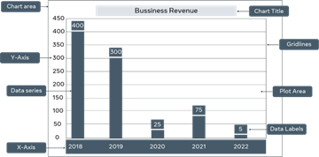
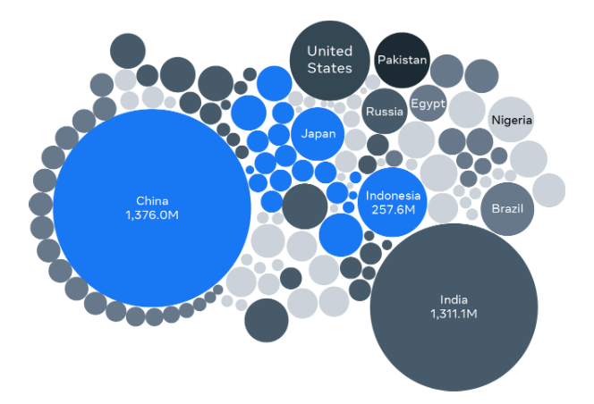
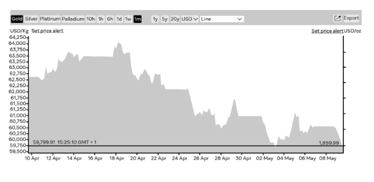
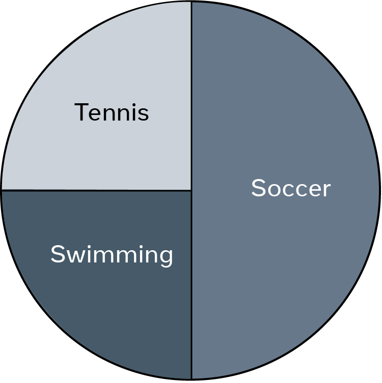

# Data Visualization and Chart Types

## Introduction

- Data collection and storage in databases from various sources.
- Importance of organizing, processing, and presenting data efficiently.
- Role of charts in presenting data visually for better understanding.

## Basic Chart Types

### Bar Chart

- Presents categorical data with rectangular bars.
- Bar heights are proportional to represented values.
- Example: Sales revenue analysis for a bookshop.

### Bubble Chart

- Compares values using bubble sizes.
- Smaller bubbles represent smaller values, larger bubbles represent larger values.
- Example: Population comparison of the world's largest countries.

### Line Chart

- Displays data points connected by straight line segments.
- Popular in data analytics for trend analysis.
- Example: Gold price fluctuation over a month.

### Pie Chart

- Represents data as slices of a whole (100%).
- Each data point allocated a slice based on its value.
- Example: Student preferences for sports in a class.

## Other Commonly Used Charts

- Dual Axis Charts: Suitable for comparing two quantities of data.
- Gantt Charts: Useful for project management and timelines.
- Heat Maps: Depict data density or values using colors.
- Scatter Plot Charts: Display individual data points on a grid.

## Choosing the Right Chart

- Different charts serve different purposes.
- Consider factors like target audience, message, and data type.
- Line charts for identifying trends, pie charts for showing parts of a whole.
- Experiment with charts to engage the audience and convey the message effectively.

## Conclusion

- Understanding basic chart types and their applications.
- Choosing the appropriate chart based on data and audience.
- Effective data visualization enhances understanding and engagement.
