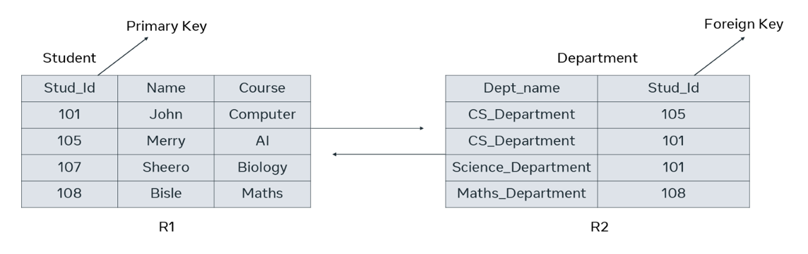

# Understanding Relational Database Tables

In this reading, we'll delve deeper into tables within a relational database, focusing on their structure, data types, primary and foreign keys, and table constraints.

## Table Structure

- **Basic Database Object**: A table is the fundamental database object in relational databases, responsible for data storage.
- **Rows and Columns**: Like any table, a database table comprises rows (records) and columns (fields).
- **Record Rows**: Rows represent individual records, spanning multiple columns.
- **Column Definitions**: Columns provide field definitions, each with a name describing the stored data (e.g., FirstName, LastName, ProductID).
- **Cells**: Cells at the intersections of rows and columns store data items.

## Data Types

- **Column Data Types**: Each column in a table has a data type, defining the acceptable values.
- **SQL-Defined Data Types**: Data types are specified by SQL (Structured Query Language).
- **Examples of Data Types**:
  - Numeric Data Types (e.g., INT, TINYINT, BIGINT, FLOAT, REAL)
  - Date and Time Data Types (e.g., DATE, TIME, DATETIME)
  - Character and String Data Types (e.g., CHAR, VARCHAR)
  - Binary Data Types (e.g., BINARY, VARBINARY)
  - Miscellaneous Data Types:
    - Character Large Object (CLOB) for large text storage.
    - Binary Large Object (BLOB) for binary data (e.g., images).

## Example Table: Student Data

- **Table Example**: Consider a student table storing data such as:
  - Student ID
  - First Name
  - Last Name
  - Date of Birth
  - Home Address
  - Faculty
These are the table's columns. 

There are also six rows within this table; one for each student. In other words, the table contains the records of six students.

Each cell in a row or record contains a piece of data such as student ID = 1, first name = Emily, last name = Williams and so on.

The student ID would probably have a data type of INT, for example. First name and last name would have a data type of VARCHAR and date of birth would have a data type of DATE.

# Understanding Tables in Relational Databases

In a relational database, tables play a pivotal role in representing the backend structure of a software system. For instance, in the context of a Student Information System, various tables, including Student, Teacher, Class, and Subject, define the system's structure.

## Table and Relation

- **Table**: In relational database terminology, a table is often referred to as a relation.
- **Tuple and Record**: A row within a table, also known as a record, is called a tuple. For instance, the student relation mentioned earlier comprises six tuples or rows.
- **Schema**: Each table or relation possesses its own schema, which defines its structure. A schema includes:
  - The table or relation name.
  - Attributes, which are the table's columns.
  - Attribute names.
  - Data types for each attribute.

## Primary Key

- **Uniquely Identifying Records**: In a table, a specific field or column is designated as a key, allowing for the unique identification of a particular tuple or row within a relation or table.
- **Primary Key**: This key is formally known as a primary key.
- **Example**: In the student table, the student ID serves as the primary key because it uniquely identifies individual student records.
- **Composite Primary Key**: In certain cases, a primary key can consist of multiple columns or fields. This occurs when a single column cannot guarantee the unique identification of a record. For example:
  - In the table below, EMP_ID values aren't unique on their own, so EMP_ID alone cannot be the primary key.
  - However, combining EMP_ID and DEPT_ID creates a unique record identifier.
  - This composite key of EMP_ID and DEPT_ID is referred to as a composite primary key.

# Understanding Foreign Keys in Databases

In the realm of databases, tables are not isolated entities but rather interconnected. These connections are established through key columns, primarily the primary key of one table, which is mirrored in another table as a foreign key. 

## Foreign Key Explained

- **Definition**: A foreign key is a field or column in a table that establishes a link or relationship between two tables.
- **Purpose**: It is used to maintain referential integrity between tables.
- **Example**: Consider the relationship between a student table and a department table:
  - The student table has a primary key called "student ID," uniquely identifying each student.
  - The department table utilizes the "student ID" as a foreign key, connecting it to the student table.
  - This linkage allows you to associate students with their respective departments.

By utilizing foreign keys, tables in a database can establish meaningful relationships, ensuring data consistency and integrity.

# Understanding Integrity Constraints in Databases

## Introduction

In the realm of databases, maintaining data consistency and integrity is paramount. This is achieved through a set of rules known as integrity constraints. These constraints ensure that data is structured and organized correctly within a database. There are three primary types of integrity constraints:

## 1. Key Constraints

- **Definition**: Key constraints require that each table has one or more columns (fields) that serve as keys for retrieving data.
- **Primary Key**: Typically, these are referred to as primary keys and should never have NULL values.
- **Uniqueness**: They must also be unique for each row of data.
- **Example**: In a "student" table, the "student ID" column serves as the primary key, allowing you to uniquely identify and retrieve data for each student.

## 2. Domain Constraints

- **Definition**: Domain constraints dictate the permissible values for a specific column, ensuring data integrity.
- **Examples**: 
  - A column designated for "first name" should not store home addresses.
  - A "contact number" column should not exceed a predetermined length (e.g., ten digits).

## 3. Referential Integrity Constraints

- **Definition**: Referential integrity constraints come into play when tables are related through foreign key columns.
- **Requirements**: The values in the foreign key column must correspond to values in the referenced column of another table.
- **Example**: In the context of a "student" table related to a "department" table via the "student ID" column, every "student ID" in the "student" table must correspond to an existing "student ID" in the "department" table.

In summary, integrity constraints are essential rules that ensure the accuracy, consistency, and reliability of data within a relational database. By enforcing key, domain, and referential integrity constraints, databases maintain data quality and prevent inconsistencies.
