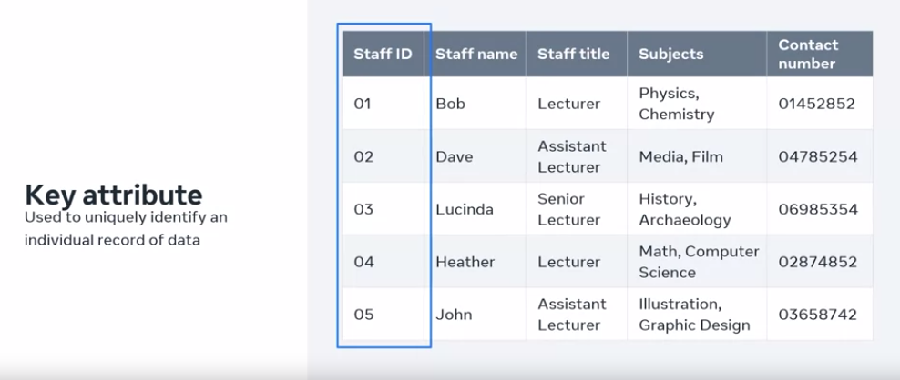
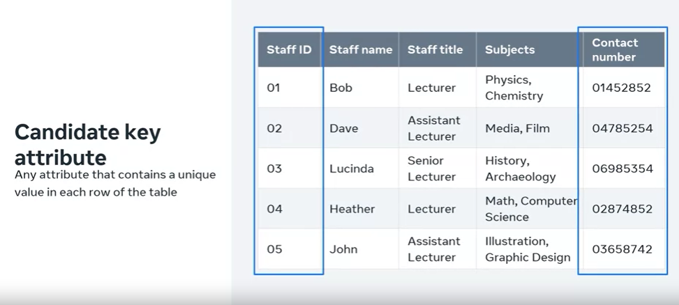
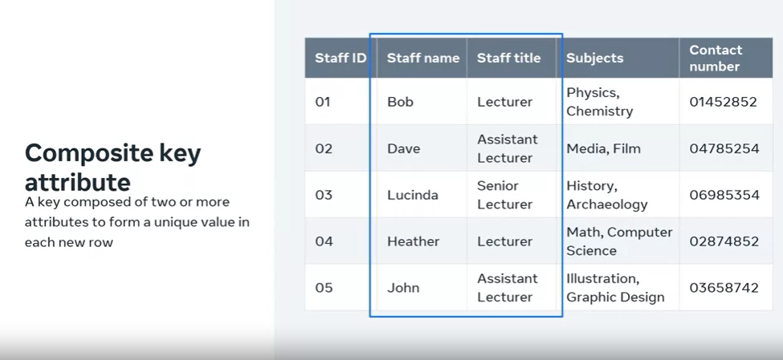
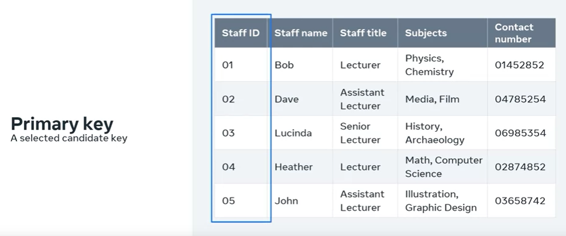
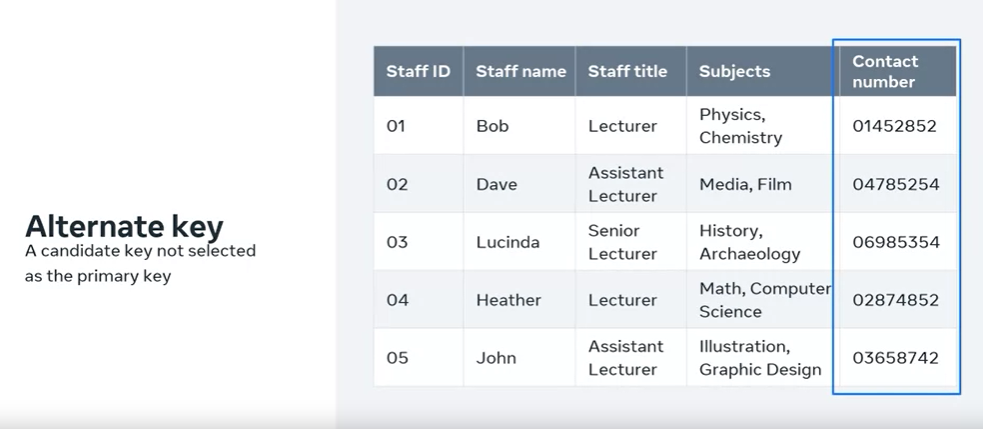
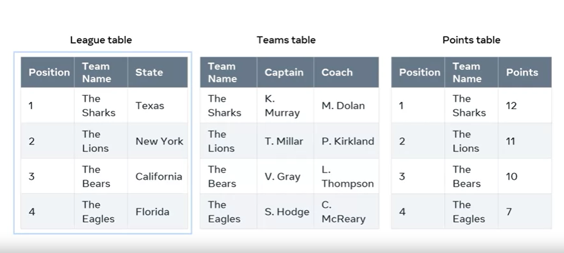

# Understanding Keys in Relational Databases

## Introduction
- In the relational database model, understanding how tables are related is crucial.
- Relationships between tables are established using **keys**.

## Main Concepts
- The relational database model is based on two main concepts: **entities** (tables) and **relations** (connections between related tables).

## Types of Key Attributes
- Key attributes are used to uniquely identify records in a table.
- Various types of key attributes exist:
  - **Key Attribute**: Uniquely identifies a record (e.g., staff ID).
  
  - **Candidate Key Attribute**: Contains unique values in each row (e.g., staff ID and contact numbers in the staff table).
  
  - **Composite Key**: Composed of two or more attributes to create a unique value (e.g., staff name and staff title).
   
  - **Primary Key**: The primary identifier for records (e.g., staff ID in the staff table).
  
  - **Alternate Key (Secondary Key)**: A candidate key not chosen as the primary key (e.g., contact number in the staff table).
  
  - **Foreign Key**: An attribute that references a unique key in another table (e.g., staff ID as a foreign key).

## Example: Sports Competition Database

- Three tables: league table, teams table, and points table.
- Each table has relevant columns representing attributes.
- Attributes can be simple (single value) or multi-value (e.g., a list of subjects taught, usually avoided in relational databases).

## Conclusion
- Keys play a crucial role in relational databases to establish relationships between tables.
- Understanding different types of keys is essential for effective database design and management.
- Primary and foreign keys have a special significance in connecting tables.
