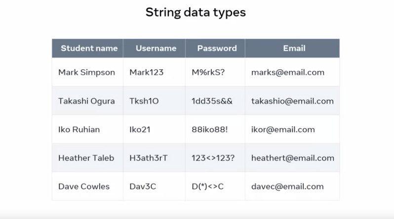
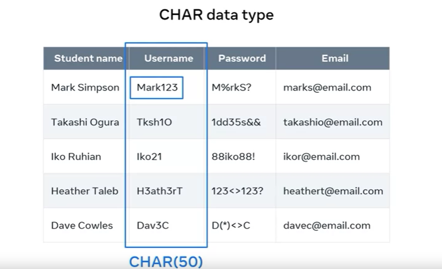
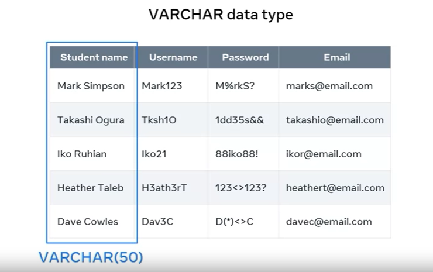

# Understanding String Data Types in Databases

## Introduction
- In this tutorial, we'll explore string data types in databases, their significance, and the differences between CHAR and VARCHAR data types.

## Data Types in Databases
- When creating a database table, it's crucial to specify column names and their corresponding data types.
- Data types determine the type of data that can be stored in each column.

## String Data Type
- The string data type is used for columns that can store a mix of character types, including alphabets, numerics, and special characters.
- It's important for maintaining data integrity.

## Example: Student Table

- Consider a "Student" table in a college database with columns like Student Name, Username, Password, and Email Address.
- The Student Name column contains only alphabet characters.
- The Username column contains alphanumeric characters.
- The Password and Email columns contain a mix of character types.

## CHAR Data Type
- CHAR (Character) is a string data type used for fixed-length character columns.
- The length of CHAR columns is predetermined and cannot be changed.
- For example, CHAR (50) means each field can store up to 50 characters.
- Ideal when you have a predefined character length requirement.

## VARCHAR Data Type
- VARCHAR (Variable Character) is a string data type for variable-length character columns.
- The length of VARCHAR columns can vary and is not fixed.
- For example, VARCHAR(50) allows input of up to 50 characters.
- Suitable when you're unsure about the length of data to be inserted.

## Commonly Used String Data Types
- TINYTEXT: For columns with less than 255 characters, like short paragraphs.
- TEXT: For columns with less than 65,000 characters, such as articles.
- MEDIUMTEXT: For columns with up to 16.7 million characters, like book text.
- LONGTEXT: Stores up to four gigabytes of text data.

## Conclusion
- String data types are essential for columns that store a mix of character types in a database.
- Understanding the differences between CHAR and VARCHAR is crucial for choosing the right data type.
- Proper data type selection ensures data accuracy and integrity in the database.
